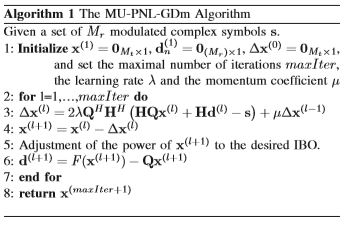
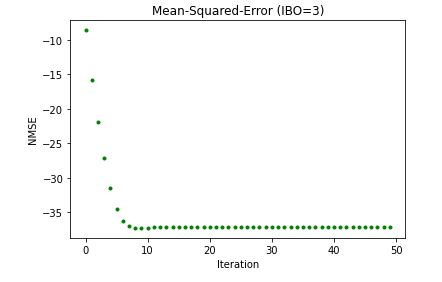
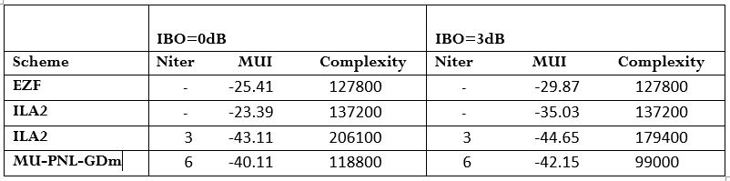
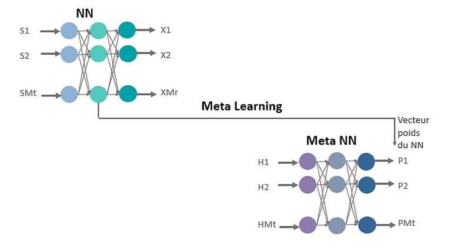
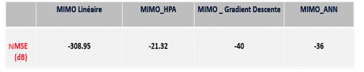

# Deep Learning pour l’estimation du canal dans les systèmes MIMO massifs en présence d’amplificateurs de puissance 

# Introduction:

Les systèmes Multiple Input Multiple Output (MIMO)  permettent d’améliorer considérablement la qualité de transmission grâce à l’exploitation de la dimension spatiale. Malgré les avancées technologiques des systèmes MIMO massifs, ces derniers restent très sensibles aux imperfections dues à l’amplificateur de puissance (PA), un élément de nature nonlinéaire et indispensable dans la chaîne de transmission. Ce dernier affecte l’acquisition de l’information de l’état du canal (CSI) limitant ainsi la fonction du pré-codage associée à celle-ci. L'efficacité énergétique des systèmes MIMO massifs est conditionné par celle des PA, qui représentent plus de 60% de l’énergie consommée par le transmetteur. L’amélioration de leur rendement a donc un impact environnemental et économique important. Ainsi, il est important de réduire les effets des imperfections causées par l’amplificateur de puissance afin de rendre ces techniques beaucoup attractives pour la future génération des réseaux cellulaire. 
Les nouvelles solutions de traitement du signal dopées au Machine Learning (ML) et à l’intelligence artificielle telles que les méthodes d’apprentissage par réseaux de neurones profonds ont permis des avancées considérables  pour la correction de la distorsion tout en mettant l’accent sur la compensation des imperfections RF et la réduction de la consommation éergétique des équipements radios.

# Chaîne de transmission :

➢Il s'agit d'un système de liaison descendante MU-MIMO massif où la station de base est équipée de (Mt = 100) antennes de transmission et sert simultanément (Mr = 10) utilisateurs.
# 1.Canal Parfaitement estimé 
#  Algorithme de Gradient Descent:

Le schéma conjoint de précodage MU et de pré-compensation des non-linéarités redevables aux amplificateurs de puissance (PA) est formulé comme un simple problème d'optimisation convexe résolu par une approche de descente de gradient (GD).

Cette méthode permet de compenser les distorsions non linéaires appliquées par les PAs tout en exploitant les degrés de liberté (DoF) offerts en équipant la station de base (BS) par un grand nombre d'antennes.
Elle permet de calculer l'erreur quadratique moyenne entre les symboles prévus S et les symboles amplifiés puis passés à travers le canal.
Les résultats de la simulation ont montré que l'algorithme converge vers des erreurs assez faibles et ainsi assurant des bonnes performances. 

Par la suite, d’après les comparaisons effectuées entre l’algorithme de descente de gradient introduite et les autres solutions existantes basées sur DPD, nous avons adopté l’algorithme de descente de gradient pour le précodage MU-MIMO Massifs et la compensation des non-linéarités causées par les PA puisqu’elle présente des bonnes performances non seulement en termes de qualité de transmission mais aussi en termes de complexité algorithmique. Dans ce cadre s’inscrit notre projet qui vise d’améliorer cet algorithme en l’approchant a un réseau de neurones profonds rapides et efficaces permettant la compensation des imperfections hardwares tout en réduisant sa complexité de calcul.
On s’intéresse dans notre projet un réseau de neurones MLP (feed-forward Network) qui
contient comme entré les symboles modulés S et comme sortie les symboles précodés déjà obtenus
par l’algorithme de descente de gradient proposé ci-dessus qui subissent une amplification,
précodage puis passage par le canal MIMO. Il s’agit bien donc d’un apprentissage supervisé le
réseau de neurones.

Pour se faire nous avons utilisés des nouveaux approches de Machine Learning tels que le Knowledge driven et le Meta Learning.
Voici l'architecture de notre solution proposée.

Nous avons pu trover des performances potentielles non seulement en terme de qualité de transmission  mais aussi en termes de complexité algorithmique. En effet, nous avons pu grace a cette solution de reduire la complexité de calcul d'un facteur de 10 par rapport ce qui est deja prprosé

