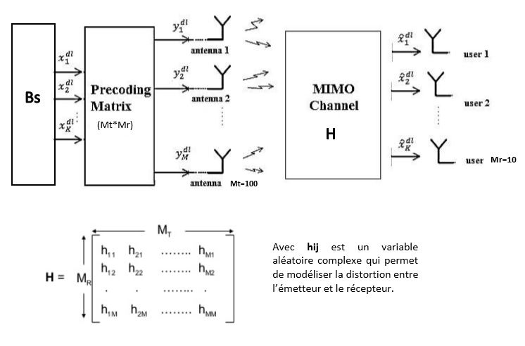

# Deep Learning pour l’estimation du canal dans les systèmes MIMO massifs en présence d’amplificateurs de puissance 
Le schéma conjoint de précodage MU et de pré-compensation des non-linéarités dues aux amplificateurs de puissance (PA) est formulé comme un simple problème d'optimisation convexe résolu par une approche de descente de gradient (GD). Cette méthode permet de compenser les distorsions non-linéaires causées par les PAs tout en exploitant les degrés de liberté (DoF) offerts en équipant la station de base (BS) par un grand nombre d'antennes. Par conséquent assurer une bonne qualité de transmission.
# Chaine de transmission

Il s’agit d’un système de liaison descendante MU-MIMO massif où la station de base est équipée de (Mt=100) antennes de transmission et sert simultanément (Mr=10) utilisateurs. ➢ On suppose que le canal est parfaitement estimé, en termes de la matrice de canal H de dimension (Mr × Mt). 
<h1 style="color:#FF5733 ; font-size:15px"> CommPy</h1> is an open source toolkit implementing digital communications algorithms in Python using NumPy and SciPy.
